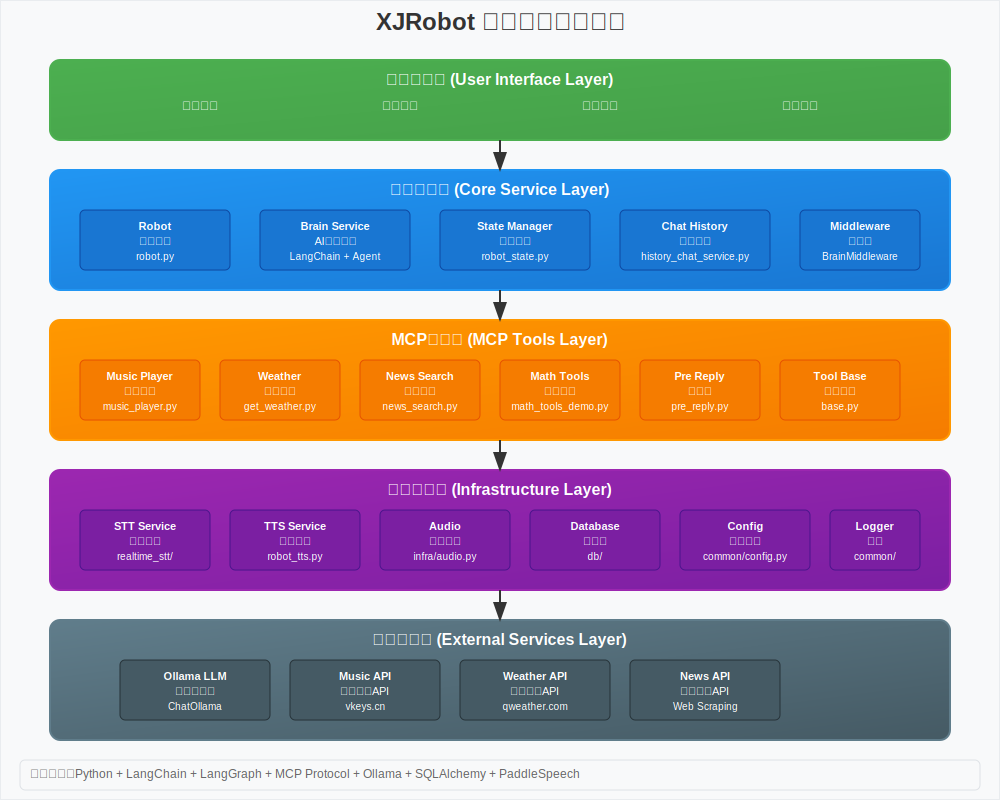

# XJRobot 项目

## 概述

XJRobot 是一个基于 Python 的智能机器人助手项目，集成了语音识别（STT）、语音合成（TTS）、AI 对话、历史聊天记录管理以及工具服务（目前仅数学计算和音乐播放）。该项目旨在构建一个交互式的机器人系统，能够处理实时语音输入、生成响应并执行特定任务。

## 功能特点

- **实时语音识别**：支持快速实时 STT 和自实现 STT。
- **语音合成**：集成 TTS 服务，用于机器人语音输出。
- **AI 大脑服务**：处理用户查询和生成智能响应。
- **历史聊天管理**：存储和管理对话历史。
- **工具集成**：目前包括数学工具演示和音乐播放器 MCPTools、新闻搜索工具、天气查询工具。
- **数据库支持**：使用 SQLAlchemy 或类似 ORM 管理数据模型。
- **机器人状态管理**：跟踪机器人当前状态。

## 系统架构

XJRobot 采用分层架构设计，从用户交互层到外部服务层，实现了模块化和可扩展的智能机器人系统：



### 架构说明

- **用户交互层**：处理语音输入/输出、文本交互和音频播放
- **核心服务层**：包含Robot主控制器、Brain服务（基于LangChain）、状态管理、聊天历史和中间件
- **MCP工具层**：基于MCP协议的模块化工具生态，支持音乐播放、天气查询、新闻搜索等功能
- **基础设施层**：提供STT/TTS服务、音频处理、数据库和配置管理等基础能力
- **外部服务层**：集成Ollama大语言模型和各种第三方API服务

## 安装

1. 克隆仓库：
   ```
   git clone https://github.com/lsm424/xjrobot
   cd xjrobot
   ```

2. 安装依赖：
   ```
   pip install -r requirements.txt
   ```

3. 配置：
   - 编辑 `config.ini` 文件，设置必要的参数
   - 如果使用 Ollama 部署，建议设置以下环境变量以充分利用 GPU 资源：
     ```bash
     export CUDA_VISIBLE_DEVICES=0,1,2,3
     export OLLAMA_GPU_LAYER=cuda
     export OLLAMA_NUM_GPU=4
     export OLLAMA_SCHED_SPREAD=1
     export OLLAMA_KEEP_ALIVE=-1
     export OLLAMA_HOST=0.0.0.0
     ```

## 使用

1. 运行主程序：
   ```
   python main.py
   ```

2. 与机器人交互：
   - 通过语音输入进行对话。
   - 机器人将处理输入、生成响应并通过 TTS 输出。

## 项目结构

- **assets/**：资源文件。
- **common/**：通用模块，包括配置、数据库连接和事件处理。
- **db/**：数据库相关模块和模型。
- **infra/**：基础设施模块，如音频处理、STT 和 TTS。
- **services/**：核心服务模块，包括大脑服务、聊天历史、机器人控制和工具。
- **main.py**：项目入口点。
- **requirements.txt**：依赖列表。
- **config.ini**：配置文件。

## 贡献

欢迎提交 Pull Request 或报告 Issue。

## 许可证

[MIT License](LICENSE)（如果适用，请替换为实际许可证）。
